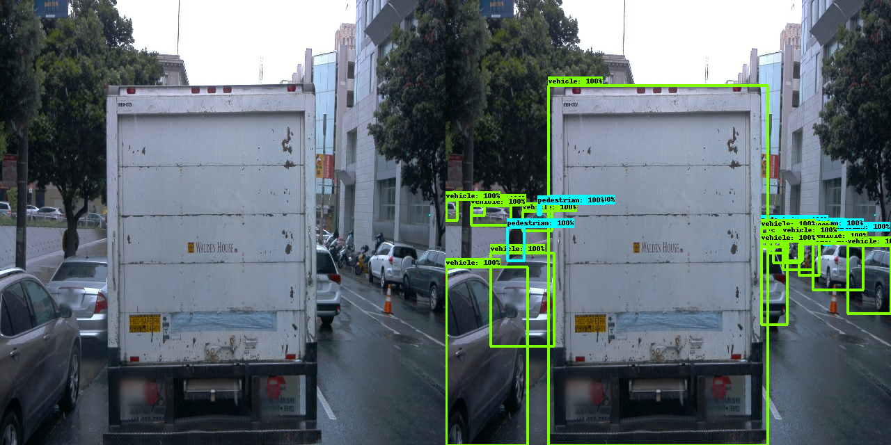
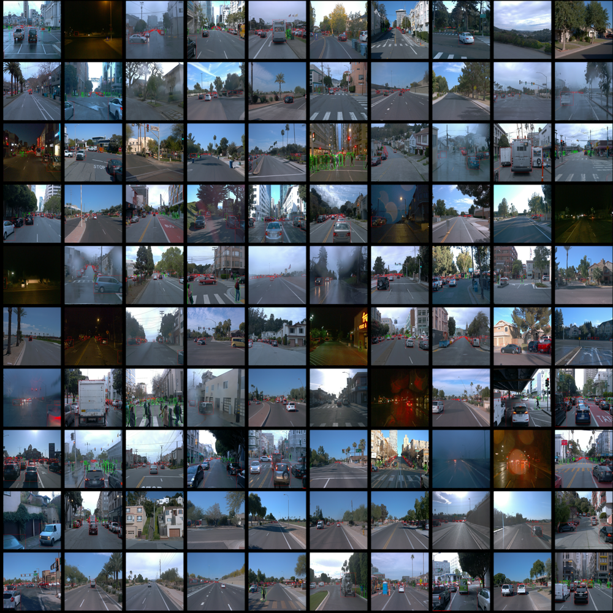
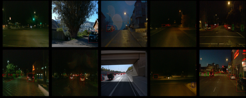

# Object Detection in an Urban Environment

## Project Overview

This project demonstrates the use of deep learning libraries to detect specific objects from a stream of images captured from a car driven in an urban environment. The images come from The Waymo Open dataset, and are pre-annotated with bounding boxes for cars, pedestrians, and cyclists. The TensorFlow Object Detection API provides a pretrained model that can be configured with different preprocessing augmentations to better generalize training data.



We first explore the data and analyze salient features. The data is split for training, evaluation, and testing, making sure that important scenarios are represented in each split. We generate a pipeline configuration for our pretrained model and train it as a reference model. We then explore further augmentations of training data to improve on the reference model performance.


## Set-Up Instructions

To run this code in a local machine with an Nvidia GPU, follow [this guide](./build/README.md) to build a Docker container from the provided [Dockerfile](./build), but note the following IMPORTANT caveats:

Training error:
```sh
AttributeError: module 'tensorflow.compat.v2.__internal__' has no attribute 'register_clear_session_function'
```
Solution:
```sh
pip install tensorflow-gpu
```

Evaluation error:
```sh
TypeError: 'numpy.float64' object cannot be interpreted as an integer
```
Solution:
```sh
pip uninstall pycocotools
pip install pycocotools
```

You may have to repeat the above solutions for each training/eval cycle.

## Data

The [data](./data) is already split for training, validation, and testing, and the config files for the reference and experimental models depend on this specific split.

If you wish to demo `create_splits.py` move the contents of /train and /val into /training_and_validation under /data/waymo/ then type:
```sh
python create_splits.py --data_dir data/waymo
```

After the split, save this [pretrained model](http://download.tensorflow.org/models/object_detection/tf2/20200711/ssd_resnet50_v1_fpn_640x640_coco17_tpu-8.tar.gz) to /experiments/pretrained_model and generate the new config file:
```sh
python edit_config.py --train_dir data/train/ --eval_dir data/val/ --batch_size 2 --checkpoint experiments/pretrained_model/ssd_resnet50_v1_fpn_640x640_coco17_tpu-8/checkpoint/ckpt-0 --label_map experiments/label_map.pbtxt
```

## Exploratory Data Analysis

To analyze our data, we first do a manual visual inspection. We take one batch from each of our 100 tf records:



Since we only have 100 tf records, we can sample all records for 1 image and do a manual visual analysis. Specifically, we want to make sure that critical scenarios are represented equally for the cross validation split.

From above samples, we see the following salient features:
1. brightness (time of day)
2. car density
3. pedestrian density
4. cyclist density
5. car distance
6. car visibility
7. sharpness
8. weather
9. car orientation

We also note samples where there are no objects of interest to classify, which is important for True Negatives.

The most important feature for this dataset is the time of day. We immediately see a disproportionate number of daytime records versus the handful of nighttime ones.

For this simple project we can prioritize night time tf records and make sure they are represented in training, evaluation, and testing.

To do this, we can make use of conventional image processing with OpenCV to detect night time tf records and split them evenly:



Here, we see two outliers that were misclassified by our nighttime classifier, one with a huge tree and another under a bridge. Decreasing the threshold should filter them out.

## Cross Validation

As discussed in our exploratory data analysis, our main focus is making sure that important domains are represented evenly in the split. We can group our data by domain and do splits within each domain. For our dataset we ensure that our scarce resource of night time records are evenly distributed.

To do this, we create a night time image classifier using OpenCV:

```sh
def is_night (batch):
    """
    Determine if tf record is night time.

    args:
        - batch [numpy arr]: sample image from tfrecord
    """
    img = batch['image'].numpy()
    # convert image to HSV
    hsv = cv2.cvtColor(img, cv2.COLOR_RGB2HSV)
    # compute mean of brightness
    brightnessavg = np.sum(hsv[:,:,2]) / (hsv.shape[0] * hsv.shape[1])
    # display only if night time, using a brightness threshold
    if (brightnessavg < 70):
        return True
    return False
```

To perform the split, we group daytime records and nighttime records, and perform the split in each group.

While Udacity's Self-Driving Car course recommends an 80/20 split for cross validation for training/(evaluation/testing), the project backend has behaved erratically with 80/20 and 90/10 splits during evaluation in both the workspace VM and in local machines, and for this reason we opted for a 70/30 split, leaving only the 3 provided tfrecords in the workspace VM for testing.

## Training

You will now launch your very first experiment with the Tensorflow object detection API. Move the `pipeline_new.config` to the `/home/workspace/experiments/reference` folder. Now launch the training process:
* a training process:
```
python experiments/model_main_tf2.py --model_dir=experiments/reference/ --pipeline_config_path=experiments/reference/pipeline_new.config
```
Once the training is finished, launch the evaluation process:
* an evaluation process:
```
python experiments/model_main_tf2.py --model_dir=experiments/reference/ --pipeline_config_path=experiments/reference/pipeline_new.config --checkpoint_dir=experiments/reference/
```

**Note**: Both processes will display some Tensorflow warnings, which can be ignored. You may have to kill the evaluation script manually using
`CTRL+C`.

To monitor the training, you can launch a tensorboard instance by running `python -m tensorboard.main --logdir experiments/reference/`. You will report your findings in the writeup.

### Improve the performances

Most likely, this initial experiment did not yield optimal results. However, you can make multiple changes to the config file to improve this model. One obvious change consists in improving the data augmentation strategy. The [`preprocessor.proto`](https://github.com/tensorflow/models/blob/master/research/object_detection/protos/preprocessor.proto) file contains the different data augmentation method available in the Tf Object Detection API. To help you visualize these augmentations, we are providing a notebook: `Explore augmentations.ipynb`. Using this notebook, try different data augmentation combinations and select the one you think is optimal for our dataset. Justify your choices in the writeup.

Keep in mind that the following are also available:
* experiment with the optimizer: type of optimizer, learning rate, scheduler etc
* experiment with the architecture. The Tf Object Detection API [model zoo](https://github.com/tensorflow/models/blob/master/research/object_detection/g3doc/tf2_detection_zoo.md) offers many architectures. Keep in mind that the `pipeline.config` file is unique for each architecture and you will have to edit it.

**Important:** If you are working on the workspace, your storage is limited. You may to delete the checkpoints files after each experiment. You should however keep the `tf.events` files located in the `train` and `eval` folder of your experiments. You can also keep the `saved_model` folder to create your videos.


### Creating an animation
#### Export the trained model
Modify the arguments of the following function to adjust it to your models:

```
python experiments/exporter_main_v2.py --input_type image_tensor --pipeline_config_path experiments/reference/pipeline_new.config --trained_checkpoint_dir experiments/reference/ --output_directory experiments/reference/exported/
```

This should create a new folder `experiments/reference/exported/saved_model`. You can read more about the Tensorflow SavedModel format [here](https://www.tensorflow.org/guide/saved_model).

Finally, you can create a video of your model's inferences for any tf record file. To do so, run the following command (modify it to your files):
```
python inference_video.py --labelmap_path label_map.pbtxt --model_path experiments/reference/exported/saved_model --tf_record_path /data/waymo/testing/segment-12200383401366682847_2552_140_2572_140_with_camera_labels.tfrecord --config_path experiments/reference/pipeline_new.config --output_path animation.gif
```

## Submission Template

### Project overview
This section should contain a brief description of the project and what we are trying to achieve. Why is object detection such an important component of self driving car systems?

### Set up
This section should contain a brief description of the steps to follow to run the code for this repository.

### Dataset
#### Dataset analysis
This section should contain a quantitative and qualitative description of the dataset. It should include images, charts and other visualizations.
#### Cross validation
This section should detail the cross validation strategy and justify your approach.

### Training
#### Reference experiment
This section should detail the results of the reference experiment. It should includes training metrics and a detailed explanation of the algorithm's performances.

#### Improve on the reference
This section should highlight the different strategies you adopted to improve your model. It should contain relevant figures and details of your findings.
