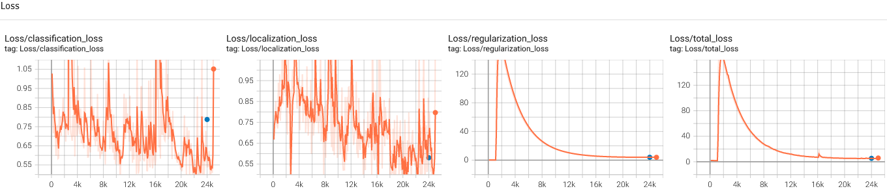

# Object Detection in an Urban Environment

## Project Overview

This project demonstrates the use of deep learning libraries to detect specific objects from a stream of images captured from a car driven in an urban environment. The images come from The Waymo Open dataset, and are pre-annotated with bounding boxes for cars, pedestrians, and cyclists. The TensorFlow Object Detection API provides a pretrained model that can be configured with different preprocessing augmentations to better generalize training data.


We first explore the data and analyze salient features. The data is split for training, evaluation, and testing, making sure that important scenarios are represented in each split. We generate a pipeline configuration for our pretrained model and train it as a reference model. We then explore further augmentations of training data to improve on the reference model performance.
<hr>

## Set-Up Instructions

To run this code in a local machine with an Nvidia GPU, follow [this guide](./build/README.md) to build a Docker container from the provided [Dockerfile](./build), but note the following IMPORTANT caveats:

Training error:
```sh
AttributeError: module 'tensorflow.compat.v2.__internal__' has no attribute 'register_clear_session_function'
```
Solution:
```sh
pip install tensorflow-gpu
```

Evaluation error:
```sh
TypeError: 'numpy.float64' object cannot be interpreted as an integer
```
Solution:
```sh
pip uninstall pycocotools
pip install pycocotools
```

You may have to repeat the above solutions for each training/eval cycle.
<hr>

## Data

The [data](./data) is already split for training, validation, and testing, and the config files for the reference and experimental models depend on this specific split.

If you wish to demo `create_splits.py` move the contents of /train and /val into /training_and_validation under /data/waymo/ then type:
```sh
python create_splits.py --data_dir data/waymo
```

After the split, save this [pretrained model](http://download.tensorflow.org/models/object_detection/tf2/20200711/ssd_resnet50_v1_fpn_640x640_coco17_tpu-8.tar.gz) to /experiments/pretrained_model and generate the new config file:
```sh
python edit_config.py --train_dir data/train/ --eval_dir data/val/ --batch_size 2 --checkpoint experiments/pretrained_model/ssd_resnet50_v1_fpn_640x640_coco17_tpu-8/checkpoint/ckpt-0 --label_map experiments/label_map.pbtxt
```
<hr>

## Exploratory Data Analysis

To analyze our data, we first do a manual visual inspection. We take one batch from each of our 100 tf records:


Since we only have 100 tf records, we can sample all records for 1 image and do a manual visual analysis. Specifically, we want to make sure that critical scenarios are represented equally for the cross validation split.

From above samples, we see the following salient features:
1. brightness (time of day)
2. car density
3. pedestrian density
4. cyclist density
5. car distance
6. car visibility
7. sharpness
8. weather
9. car orientation

We also note samples where there are no objects of interest to classify, which is important for True Negatives.

The most important feature for this dataset is the time of day. We immediately see a disproportionate number of daytime records versus the handful of nighttime ones.

For this simple project we can prioritize night time tf records and make sure they are represented in training, evaluation, and testing.

To do this, we can make use of conventional image processing with OpenCV to detect night time tf records and split them evenly:


Here, we see two outliers that were misclassified by our nighttime classifier, one with a huge tree and another under a bridge. Decreasing the threshold should filter them out.
<hr>

## Cross Validation

As discussed in our exploratory data analysis, our main focus is making sure that important domains are represented evenly in the split. We can group our data by domain and do splits within each domain. For our dataset we ensure that our scarce resource of night time records are evenly distributed.

To do this, we create a night time image classifier using OpenCV:

```sh
def is_night (batch):
    """
    Determine if tf record is night time.

    args:
        - batch [numpy arr]: sample image from tfrecord
    """
    img = batch['image'].numpy()
    # convert image to HSV
    hsv = cv2.cvtColor(img, cv2.COLOR_RGB2HSV)
    # compute mean of brightness
    brightnessavg = np.sum(hsv[:,:,2]) / (hsv.shape[0] * hsv.shape[1])
    # display only if night time, using a brightness threshold
    if (brightnessavg < 70):
        return True
    return False
```

To perform the split, we group daytime records and nighttime records, and perform the split in each group.

While Udacity's Self-Driving Car course recommends an 80/20 split for cross validation for training/(evaluation/testing), the project backend has behaved erratically with 80/20 and 90/10 splits during evaluation in both the workspace VM and in local machines, and for this reason we opted for a 70/30 split, leaving only the 3 provided tfrecords in the workspace VM for testing.
<hr>

## Training

## Reference Experiment

The reference experiment is based on our post-split configuration of the pretrained model, the SSD ResNet50 V1 FPN 640x640 (RetinaNet50). The configuration file is [here](./experiments/reference/pipeline_new.config).

The config file uses the following preprocessing data augmentations:
```sh
    random_horizontal_flip {
    }
```
```sh
    random_crop_image {
      min_object_covered: 0.0
      min_aspect_ratio: 0.75
      max_aspect_ratio: 3.0
      min_area: 0.75
      max_area: 1.0
      overlap_thresh: 0.0
    }
```

Results for loss are as follows:


Results for recall and precision are as follows:


These results are far from ideal, and advice from course mentors suggest problems in the backend framework. However, we proceed to improve on this model.
<hr>

## Improve on the Reference

## Exploratory Data Augmentations

For improving the reference model, we explore the following preprocessing options for data augmentation:

1. SSD Random Crop
Replacing the default random crop option in the reference config with an SSD version might prove useful.
```sh
    ssd_random_crop {
      operations {
        min_object_covered: 0.0
        min_aspect_ratio: 0.875
        max_aspect_ratio: 1.125
        min_area: 0.5
        max_area: 1.0
        overlap_thresh: 0.0
        clip_boxes: False
        random_coef: 0.375
      }
      operations {
        min_object_covered: 0.25
        min_aspect_ratio: 0.75
        max_aspect_ratio: 1.5
        min_area: 0.5
        max_area: 1.0
        overlap_thresh: 0.25
        clip_boxes: True
        random_coef: 0.375
      }
    }
```


2. Random Black Patches
Black patches may allow the model to generalize better with obstructed images.
```sh
    random_black_patches {
      max_black_patches: 20
      probability: 0.95
      size_to_image_ratio: 0.12
    }
```


3. Random JPEG Quality
Simulating quality variance might help with recording variance.
```sh
    random_jpeg_quality {
      random_coef: 0.5
      min_jpeg_quality: 70
      max_jpeg_quality: 90
    }
```


4. Random Image Scale
Random image scaling might help with distant and close-up objects.
```sh
    random_image_scale {
      min_scale_ratio: 0.8
      max_scale_ratio: 2.2
    }
```


5. Random Adjust Brightness
More brightness variance can help with our lack of night time training data.
```sh
    random_adjust_brightness {
      max_delta: 0.2
    }
```

<hr>

## Experiment 0

For Experiment 0, we use the following data augmentations:

1. ssd_random_crop
2. random_image_scale
3. random_adjust_brightness
4. random_jitter_boxes
5. random_black_patches

We replace the default random crop with the SSD version, and keep the random horizontal flip.

The loss results are as follows:



The precision and recall results are as follows:


Interestingly, the results are arguably worse. But as noted in the reference section and noted by the course mentors, the project environment setup has demonstrated erratic behavior. We now proceed with the next experiment.
<hr>

## Experiment 1

For Experiment 1, we keep the reference preprocessing, and add the following:

1. random_black_patches
2. random_jpeg_quality
3. random_image_scale
4. random_adjust_brightness

Results for loss are as follows:


Results for precision and recall are as follows:


We finally see improvements over the reference model for loss, precision, and recall.
<hr>

## Project Reflections

This project, while a great learning experience, was set back by lack of testing of the workspace and Docker environments. I spent much more time trying to make the code run in my local machine than coding and analyzing, as the Docker environment could not run the project. While the workspace VM worked, it was riddled with out of memory errors in both the browser and tensorflow, making it impossible to run jupyter and tensorboard on the browser. Upon further investigation, the workspace VM was using outdated libraries that are no longer online, and I believe this same environment was used to write the project framework. However, the provided Docker file installed different library versions that proved to be incompatible with the project. While I was finally able to configure a local environment to run the project, the results are still rather suspect. In hindsight, it would have been faster and more fruitful to write my own backend to use the updated TensorFlow Object Detection API.